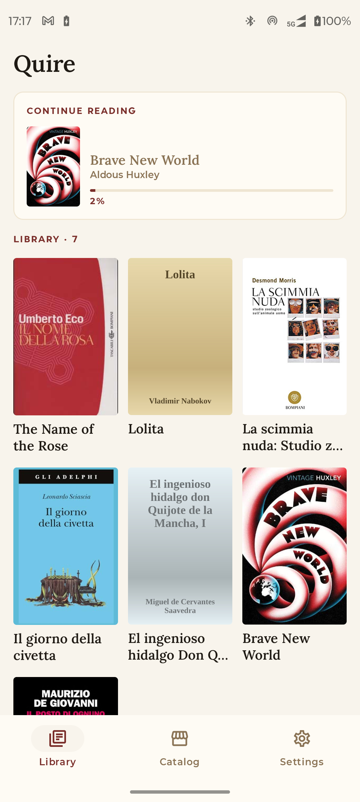
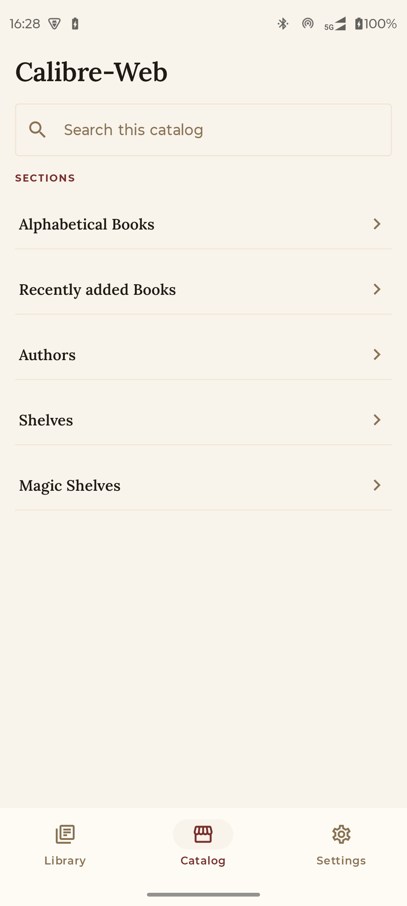
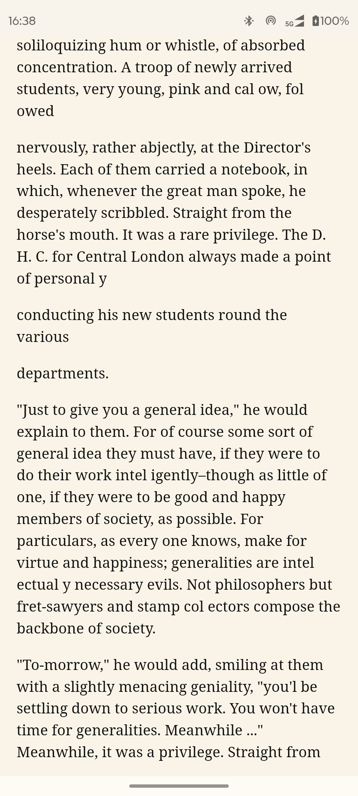

<p align="center">
  
</p>

<h1 align="center">Quire</h1>

<p align="center">
  <em>Self-hosted EPUB reader for calibre-web. No telemetry, no cloud, your data.</em>
</p>

<p align="center">
  <a href="https://github.com/vitofico/quire/actions/workflows/android-ci.yaml"></a>
  <a href="https://github.com/vitofico/quire/actions/workflows/server-ci.yaml"></a>
  <a href="LICENSE"></a>
</p>

<p align="center">
  
  &nbsp;&nbsp;
  
  &nbsp;&nbsp;
  
</p>

## What it is

A self-hosted reading stack for people who already run [calibre-web]:

- **Quire** — native Android EPUB reader (Kotlin / Compose / Readium).
- **Quire Server** — small FastAPI service that stores reading progress
  (and later bookmarks) in Postgres. Formerly named `opds-sync`; the
  Python package is now `quire_server` and the container image is
  `ghcr.io/vitofico/quire-server` (the legacy `ghcr.io/vitofico/opds-sync`
  tag is dual-published for one release cycle).

calibre-web stays the source of truth for books. Quire Server is the
source of truth for reading state. Quire reconciles both on the device.

```
[calibre-web]  ──OPDS + HTTP Basic──>  [Android: Quire]
                                              │
                                              │  HTTPS + same Basic creds
                                              ▼
                                       [quire-server]
                                              │
                                              ▼
                                         [Postgres]
```

## Why this exists

The starting point was an OPDS catalog (calibre-web) and a simple need:
read books from it on Android, with reading progress synced across
devices.

That's harder than it sounds in the self-hosted world:

- **KOReader has KOSync**, but KOSync is shaped around KOReader's
  identity and document model. Using it as a generic sync layer for
  other clients means working against the grain.
- **Stock OPDS readers** on Android either don't sync reading position
  to a server you control, or sync it through a vendor cloud.

So Quire Server (originally shipped as `opds-sync`) is the piece that
was missing: a small, reader-agnostic progress server that speaks
OPDS-style document identity and uses your **calibre-web account as
the only credential** — no second IdP, no separate sync account. Quire
is the Android client built against it; nothing in the server design
is Quire-specific.

## Privacy

- No analytics, no crash reporting, no third-party SDKs.
- Network calls go to your calibre-web instance and your Quire Server.
  If your administrator has enabled AI features and you have opted in,
  Quire Server will additionally call the AI endpoint your administrator
  configured (such as a self-hosted Ollama, or a third-party provider you
  have chosen) and the public Wikipedia and OpenLibrary APIs to ground the
  generated insights. None of these AI-related calls happen unless you
  opt in from Quire's settings; the Android app itself talks only to your
  calibre-web instance and your Quire Server.
- Credentials are stored in Android Keystore (hardware-backed where the
  device supports it).

## AI features (optional)

Quire optionally calls AI for book insights and library analysis. AI is
**off by default**. The Quire Server admin enables it server-side by
configuring an OpenAI-compatible endpoint (Ollama, llama.cpp, vLLM,
OpenAI, OpenRouter, …); each user then opts in from Quire's settings.

When enabled, Quire Server sends the EPUB metadata (title, author,
publisher, description, subjects) of books a user opens to the
configured AI endpoint, plus deterministic queries to Wikipedia and
OpenLibrary to ground the generated insights with citations. The
generated insight is cached server-side per book and reused across all
of that user's devices and other opted-in users on the same instance.

Surfaces in the app today:

- **Book-detail cards** — summary, author, series, themes, craft notes,
  comparative anchors, discussion prompts, content advisory, sources.
- **Catalog detail screen** — previews the same insight cards before
  download via an `info` icon on each catalog tile. Once the EPUB is
  downloaded the cached catalog insight is promoted onto the canonical
  identity so the book-detail screen shows it immediately.
- **Library Stats** — totals, finished / in-progress / abandoned counts,
  top authors, top themes, backed by `GET /library/v1/stats`.
- **Library Insights** — a per-user reader profile (narrative, in-library
  recommendations, OpenLibrary discovery recommendations, AI-suggested
  reads), refreshed on demand from the screen. Backed by
  `GET /ai/v1/profile` + `POST /ai/v1/profile/refresh`. A "Delete
  profile" action in Settings wipes the cached row.
- **Abandoned book UX** — books you've marked abandoned drop out of
  Library by default; a "Show abandoned" toggle reveals them.

For configuration details see [`server/README.md`](server/README.md).

## Install

Grab the latest APK from [Releases], install it, and point it at your
calibre-web URL on first launch. F-Droid listing is planned.

For the sync server, see [`server/README.md`](server/README.md) — it
ships two reference docker-compose files (`docker-compose.yml` for
"bring your own proxy"; `docker-compose.full.yml` for a Caddy-fronted
full stack with calibre-web + quire-server + TLS behind one base URL).

## Roadmap

**Shipped:** OPDS catalog browsing and search, EPUB rendering with
Readium, local reading progress, progress sync (server + Android
client), single-credential auth via calibre-web Basic, per-user library
mirror with stats (`GET /library/v1/stats`), optional AI book insights
(schema v4: themes, craft notes, comparative anchors, discussion
prompts), optional AI reader profile with in-library and OpenLibrary
discovery recommendations, abandoned-book status.

**Planned:** bookmarks sync, calibre-web read-only consumer plugin.

**Not on the roadmap:** PDF support (deferred), separate IdP or
non-calibre-web auth.

This is pre-1.0 software built for the author's personal eink device.
It works and it's tested, but the API and DB schema may still change.
Pin a commit if you depend on it.

## Build from source

```sh
# Build the debug APK using the project's Docker-based Gradle wrapper.
# Host JDK and Android SDK are not required.
scripts/dgradle :app:assembleDebug
# APK at app/build/outputs/apk/debug/app-debug.apk
```

Sync server development:

```sh
cd server
uv venv && source .venv/bin/activate
uv pip install -e ".[dev]"
uv run pytest                                  # spins up Postgres in Docker
QUIRE_SERVER_CWA_BASE_URL=https://library.example.com \
  uv run uvicorn quire_server.main:app --reload   # http://localhost:8000
```

## Repo layout

```
app/                  Android entry point — Compose UI, navigation, DI wiring
auth/                 Keystore-backed calibre-web Basic credential store
core/identity/        Document identity: hash + dc:identifier normalization
core/model/           Domain types (Document, Progress, Bookmark)
data/local/           Room database, DAOs
data/opds/            calibre-web OPDS client
data/sync/            quire-server REST client + WorkManager job
data/library/         quire-server /library/v1 HTTP client (stats today)
reader/               Readium navigator integration
server/               quire-server (Python / FastAPI; formerly opds-sync)
docs/                 Architecture, development, sync API reference
scripts/dgradle       Gradle wrapper that runs inside the project's Docker image
Dockerfile            Reproducible Android build environment (linux/amd64)
```

## Documentation

- [`docs/architecture.md`](docs/architecture.md) — components, document
  identity, sync model, conflict resolution, auth.
- [`docs/development.md`](docs/development.md) — module layout, build
  commands, testing, CI, releases.
- [`docs/sync-api.md`](docs/sync-api.md) — REST surface of Quire Server.

## Contributing

See [`CONTRIBUTING.md`](CONTRIBUTING.md). TL;DR: gitmoji + conventional
commits, `scripts/dgradle test` and `cd server && uv run pytest` must
pass, no telemetry / analytics PRs.

## Security

If you find a vulnerability, please follow [`SECURITY.md`](SECURITY.md)
rather than opening a public issue.

## License

Apache-2.0. See [`LICENSE`](LICENSE) and [`NOTICE`](NOTICE).

## Support

If Quire is useful to you and you'd like to chip in, you can buy me a coffee:

[](https://ko-fi.com/vito507767)

[calibre-web]: https://github.com/janeczku/calibre-web
[Releases]: https://github.com/vitofico/quire/releases
