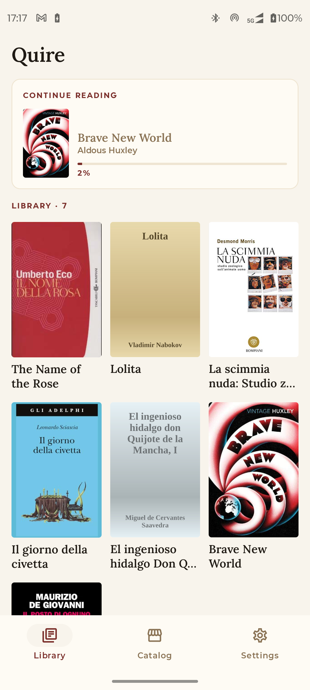
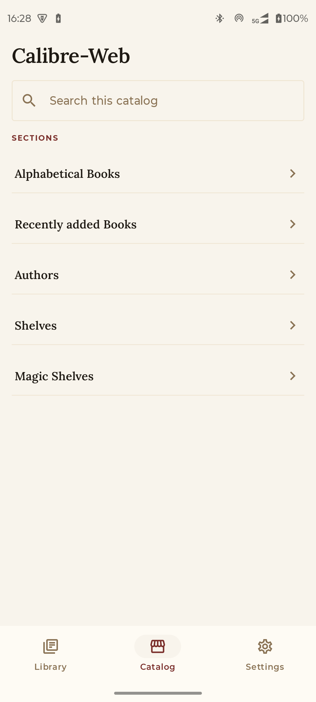

<p align="center">
  
</p>

<h1 align="center">Quire</h1>

<p align="center">
  <strong>quire</strong> <em>&nbsp;/ˈkwaɪər/ &nbsp;n.&nbsp; — a gathering of folded leaves, bound into a book.</em>
</p>

<p align="center">
  <em>A privacy-first Android EPUB reader for calibre-web — gathering your library,<br>
  your reading state, and opt-in, self-hosted AI into one bound whole.<br>
  No telemetry, no cloud, your data.</em>
</p>

<p align="center">
  <a href="https://github.com/vitofico/quire/actions/workflows/android-ci.yaml"></a>
  <a href="https://github.com/vitofico/quire/actions/workflows/server-ci.yaml"></a>
  <a href="LICENSE"></a>
</p>

<p align="center">
  
  &nbsp;&nbsp;
  
  &nbsp;&nbsp;
  
</p>

## What it is

A self-hosted reading stack for people who already run [calibre-web]:

- **Quire** — native Android EPUB reader (Kotlin / Compose / Readium).
- **Quire Server** — small FastAPI service that stores reading state and
  your per-user library mirror in Postgres, and orchestrates the optional
  AI features. The Python package is `quire_server` and the container image
  is `ghcr.io/vitofico/quire-server`.
- **Optional, private AI** — book insights, catalog previews, a reader
  profile, recommendations, and barcode book-scanning — all routed through
  an OpenAI-compatible endpoint *you* control. Off by default, opt-in per
  user. [Jump to AI ↓](#ai-on-your-terms)

calibre-web stays the source of truth for books. Quire Server is the
source of truth for reading state. Quire reconciles both on the device.

```
[calibre-web]  ──OPDS + HTTP Basic──>  [Android: Quire]
                                              │
                                              │  HTTPS + same Basic creds
                                              ▼
                                       [quire-server]
                                              │
                                              ▼
                                         [Postgres]
```

## AI, on your terms

Most reading apps that got "smart" did it by shipping your library to
someone else's cloud. Quire does the opposite: the intelligence runs
against an endpoint **you** point it at, it is **off by default**, and
every user **opts in** individually. The admin configures any
OpenAI-compatible endpoint — Ollama, llama.cpp, vLLM, OpenAI,
OpenRouter, … — and if AI isn't enabled and opted into, Quire makes no
AI calls at all.

What that unlocks:

### 📷 Scan a book before you buy it

Point your phone at a physical book's barcode (or type the ISBN) and
Quire tells you, on the spot, whether it belongs on your shelf:

- **Reader-affinity score** — a deterministic 0–100 match score with a
  band (very low → very high) and plain-language reasons, computed from
  the authors, series, and subjects already in your library. **No LLM,
  no AI network call** — instant, private, and works as a snap judgment
  in a bookshop.
- **Already-owned detection** — tells you if it's in your library and
  where you left off (unread / in progress / finished / abandoned).
- **Cover + one-tap deep dive** — pulls the cover from OpenLibrary and,
  if you want more, loads the full AI insight card on demand.

### 📖 Insights that actually say something

Per-book insight cards generated by the LLM and **grounded with real
citations** from Wikipedia and OpenLibrary — not hallucinated blurbs:

- intro · author context · series placement
- themes & **craft notes** (how the book is *made*, not just what it's about)
- **comparative anchors** ("if you liked…")
- a distinctive take · discussion prompts · content advisory · cited sources

Insights show up **on catalog tiles before you download** (tap the info
icon), so you can size up a book before it ever touches your device.
Download it and the cached insight is promoted onto the owned book
instantly. Cards are cached per book and shared across every opted-in
reader on your instance, so you pay for each generation once.

### 🎚️ In your voice, in your language

Set the tone — neutral, enthusiastic, scholarly, or casual — and the
language: 100+ options, or **`auto`** to follow the book's own language.
Don't like a card? Regenerate it with feedback.

### 🧭 A reader profile that recommends

From the books you've finished, Quire builds an AI-written narrative of
your taste (refresh on demand) that powers three flavors of suggestions:

- **In-library** — unfinished books you *already own* that fit your taste.
- **Discovery** — more from authors you've finished, fetched from OpenLibrary.
- **AI-suggested** — books you don't own yet, worth hunting down.

Plus **Library Stats** (finished / in-progress / abandoned counts, top
authors, top themes) and an **abandoned-book** status that quietly drops
DNFs out of your library view until you ask for them.

### 🔧 Built for self-hosters

Per-user daily budgets and quotas, an AI **health endpoint**, and deploy
modes for **sync-only**, **AI-only**, or **full-stack** operation. Bring
your own model; cap your own spend.

> All of the above is opt-in and routed through your endpoint. For setup,
> env vars, and deploy modes see [`server/README.md`](server/README.md).

## Why this exists

The starting point was an OPDS catalog (calibre-web) and a simple need:
read books from it on Android, with reading progress synced across
devices.

That's harder than it sounds in the self-hosted world:

- **KOReader has KOSync**, but KOSync is shaped around KOReader's
  identity and document model. Using it as a generic sync layer for
  other clients means working against the grain.
- **Stock OPDS readers** on Android either don't sync reading position
  to a server you control, or sync it through a vendor cloud.

So Quire Server is the piece that was missing: a small, reader-agnostic
progress server that speaks OPDS-style document identity and uses your
**calibre-web account as the only credential** — no second IdP, no
separate sync account. Quire is the Android client built against it;
nothing in the server design is Quire-specific.

## Privacy

Apache-2.0, calibre-web-only, **no telemetry, ever.**

- No analytics, no crash reporting, no third-party SDKs.
- Network calls go to your calibre-web instance and your Quire Server.
  If your administrator has enabled AI features and you have opted in,
  Quire Server will additionally call the AI endpoint your administrator
  configured (such as a self-hosted Ollama, or a third-party provider you
  have chosen) and the public Wikipedia and OpenLibrary APIs to ground the
  generated insights. None of these AI-related calls happen unless you
  opt in from Quire's settings; the Android app itself talks only to your
  calibre-web instance and your Quire Server.
- Credentials are stored in Android Keystore (hardware-backed where the
  device supports it).

## Install

Install Quire from [F-Droid] or grab the latest APK from [Releases],
then point it at your calibre-web URL on first launch.

<a href="https://f-droid.org/packages/io.theficos.quire/">
  
</a>

For the sync server, see [`server/README.md`](server/README.md) — it
ships two reference docker-compose files (`docker-compose.yml` for
"bring your own proxy"; `docker-compose.full.yml` for a Caddy-fronted
full stack with calibre-web + quire-server + TLS behind one base URL).

## Roadmap

**Shipped:** OPDS catalog browsing and search, EPUB rendering with
Readium, local reading progress, progress sync (server + Android
client), single-credential auth via calibre-web Basic, per-user library
mirror with stats (`GET /library/v1/stats`), optional AI book insights
(schema v4: themes, craft notes, comparative anchors, discussion
prompts), optional AI reader profile with in-library and OpenLibrary
discovery recommendations, abandoned-book status.

**Planned:** bookmarks sync, calibre-web read-only consumer plugin.

**Not on the roadmap:** PDF support (deferred), separate IdP or
non-calibre-web auth.

This is pre-1.0 software built for the author's personal eink device.
It works and it's tested, but the API and DB schema may still change.
Pin a commit if you depend on it.

## Build from source

```sh
# Build the debug APK using the project's Docker-based Gradle wrapper.
# Host JDK and Android SDK are not required.
scripts/dgradle :app:assembleDebug
# APK at app/build/outputs/apk/debug/app-debug.apk
```

Sync server development:

```sh
cd server
uv venv && source .venv/bin/activate
uv pip install -e ".[dev]"
uv run pytest                                  # spins up Postgres in Docker
QUIRE_SERVER_CWA_BASE_URL=https://library.example.com \
  uv run uvicorn quire_server.main:app --reload   # http://localhost:8000
```

## Repo layout

```
app/                  Android entry point — Compose UI, navigation, DI wiring
auth/                 Keystore-backed calibre-web Basic credential store
core/identity/        Document identity: hash + dc:identifier normalization
core/model/           Domain types (Document, Progress, Bookmark)
data/local/           Room database, DAOs
data/opds/            calibre-web OPDS client
data/sync/            quire-server REST client + WorkManager job
data/library/         quire-server /library/v1 HTTP client (stats today)
reader/               Readium navigator integration
server/               quire-server (Python / FastAPI)
docs/                 Architecture, development, sync API reference
scripts/dgradle       Gradle wrapper that runs inside the project's Docker image
Dockerfile            Reproducible Android build environment (linux/amd64)
```

## Documentation

- [`docs/architecture.md`](docs/architecture.md) — components, document
  identity, sync model, conflict resolution, auth.
- [`docs/development.md`](docs/development.md) — module layout, build
  commands, testing, CI, releases.
- [`docs/sync-api.md`](docs/sync-api.md) — REST surface of Quire Server.

## Contributing

See [`CONTRIBUTING.md`](CONTRIBUTING.md). TL;DR: gitmoji + conventional
commits, `scripts/dgradle test` and `cd server && uv run pytest` must
pass, no telemetry / analytics PRs. External contributors also need to
sign the [Quire CLA](CLA.md) on the PR before it can be merged — see
CONTRIBUTING.md for the one-line comment.

## Security

If you find a vulnerability, please follow [`SECURITY.md`](SECURITY.md)
rather than opening a public issue.

## License

Apache-2.0. See [`LICENSE`](LICENSE) and [`NOTICE`](NOTICE).

## Support

If Quire is useful to you and you'd like to chip in, you can buy me a coffee:

[](https://ko-fi.com/vito507767)

[calibre-web]: https://github.com/janeczku/calibre-web
[Releases]: https://github.com/vitofico/quire/releases
[F-Droid]: https://f-droid.org/packages/io.theficos.quire/
